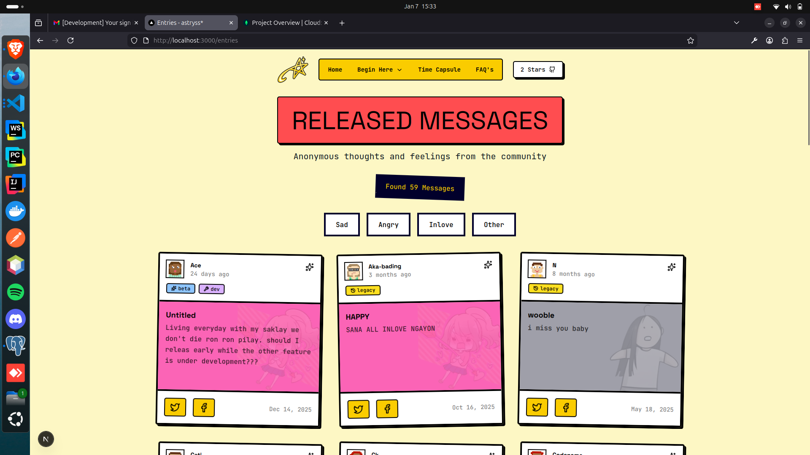

# Astryss
Send your feelings to the stars — a place for your thoughts to live. The stars are listening.

## Roadmap
> Current roadmap for Voidify goes here

- [ ] Loading & 404 State/Page 
- [ ] Contributors Section
- [ ] Time Capsule
- [ ] Unsent Messages
- [ ] Automatic Emotion Detection (AI)

## Legacy Roadmap - The Early Version (2023)
> Below is the original roadmap I wrote back in 2023, that hasn't been implemented. Which I plan to gets its checkmark in upcoming V2 release.

- [ ] Enhance user friendliness - More validation (clearer instructions)
- [ ] Ensure that "react," "comment," "share," and "report" features work properly.
- [ ] Add darkmode function
- [x] Add faqs
- [ ] Anonymous message similar with ngl
- [ ] Our team page
- [x] Host a cloud that can upload image

*Grammatical error alert. This roadmap was written 3 years ago, be nice. <3*

## Contributing

Contributions, issues, and feature requests are welcome!.
